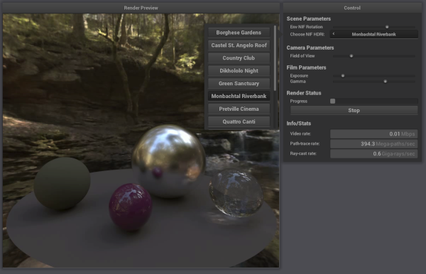

# Remote User Interface



This is a prototype remote user-interface that connects to a rendering server ([IPU path tracer](https://github.com/markp-gc/ipu_path_trace)) running on a remote IPU machine.

It has been tested on Mac OSX 11.6 and Ubuntu 18. It may also work on other platforms
where the dependencies can be satisfied.

### Dependencies

The following are required system dependencies:
- CMake 3.20 or later (note that you can install the latest version via `pip install` if your system package manager installs an older version).
- Boost (only tested with 1.78).
- FFmpeg (See README.md in the [videolib submodule](https://github.com/markp-gc/videolib) for instructions and version compatibilty).
- Ubuntu: GLFW
  - sudo apt install libglfw3-dev
- Mac OSX: Xcode with metal support
  - Install a version of Xcode that is compatible with your version of OSX (only tested on OSX 11.6).

The following dependencies are cloned and built as submodules (so do not need to be installed manually):
- [nanogui](https://github.com/mitsuba-renderer/nanogui): a cross platform toolkit for simple GUI applications.
- [packetcomms](https://github.com/mpups/packetcomms): a simple TCP/IP communication protocol designed for low latency.
- [videolib](https://github.com/markp-gc/videolib): A wrapper for FFmpeg that supports TCP video streaming using packetcomms.


## Building

Install the dependencies above and then build using CMake:

```
git clone --recursive https://github.com/markp-gc/remote_render_ui
mkdir remote_render_ui/build
cd remote_render_ui/build
cmake -G Ninja ..
ninja -j16
```


## Running

1. Launch the remote application on the remote host. Wait until it logs that it is waiting for connection.
  - E.g.: `[12:26:06.674469] [I] [51157] User interface server listening on port 4000`

2. Launch the client (this program) and connect to the same port:
  - E.g.: `./remote-ui --hostname <remote-hostname-or-IP-address> --port 4000 --nif-paths ../nifs.json`
  - The JSON file contains a list of paths to NIF models *on the remote*. These will be selectable in the UI.
  - Run with `--help` for a full list of options.
